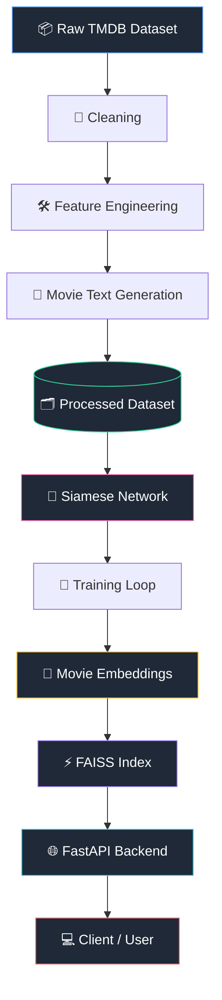
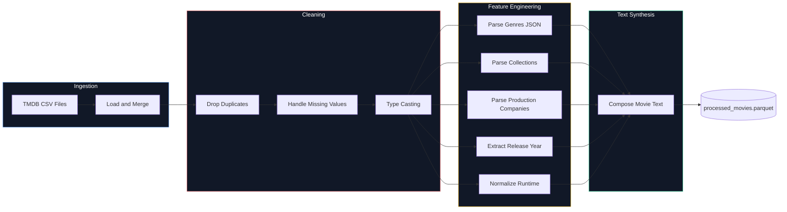
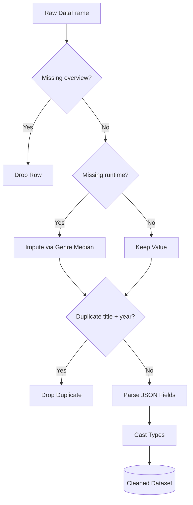
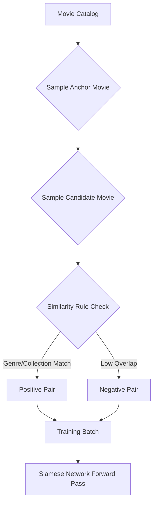
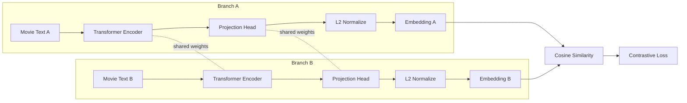
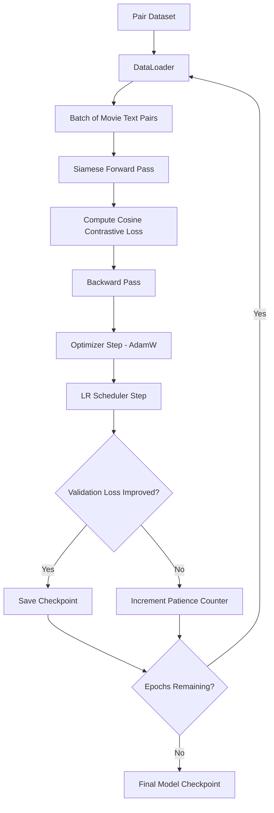
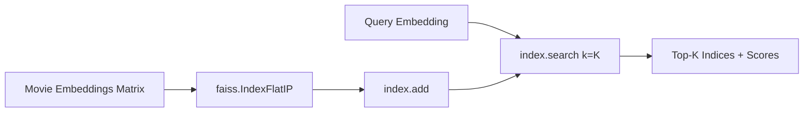
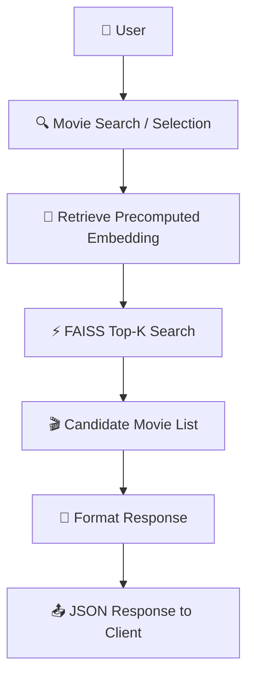

<div align="center">

# 🎬 Deep Learning Movie Recommendation Engine

### Semantic Movie Recommendations via Siamese Transformer Networks and FAISS Vector Search

[](https://www.python.org/)
[](https://pytorch.org/)
[](https://huggingface.co/docs/transformers)
[](https://github.com/facebookresearch/faiss)
[](https://fastapi.tiangolo.com/)
[](https://www.docker.com/)
[](#license)
[](#)
[](https://github.com/psf/black)

</div>

---

## Overview

The **Deep Learning Movie Recommendation Engine** is a production-ready recommendation system that learns **semantic similarity between movies** using a **Siamese Transformer Network** trained with **contrastive learning**. Unlike classical content-based recommenders that rely on sparse lexical representations such as TF-IDF or Bag-of-Words, this system learns **dense, continuous movie embeddings** that capture narrative, thematic, and stylistic similarity — enabling recommendations that generalize far beyond keyword overlap.

Once trained, movie embeddings are generated once and indexed using **FAISS (Facebook AI Similarity Search)**, enabling sub-millisecond Top-K retrieval over large movie catalogs. The entire system is exposed through a lightweight, asynchronous **FastAPI** backend, making it easy to integrate into any downstream product.

> **Design Philosophy:** Treat movie recommendation as a metric learning problem, not a classification problem. Instead of predicting a rating or a category, the network learns a geometry in embedding space where semantically similar movies are close together and dissimilar movies are far apart.

### Key Features

| Capability | Description |
|---|---|
| 🧠 **Transformer-based Encoding** | Movies are encoded using pretrained transformer language models fine-tuned for semantic similarity |
| 🔗 **Siamese Architecture** | A shared-weight twin network ensures embeddings live in a single, consistent metric space |
| 📉 **Contrastive Learning** | Cosine contrastive loss pulls similar movie pairs together and pushes dissimilar pairs apart |
| ⚡ **Dynamic Pair Generation** | Positive/negative pairs are sampled on-the-fly per epoch instead of being materialized and stored |
| 🚀 **FAISS Vector Search** | `IndexFlatIP` enables exact, GPU-accelerable cosine similarity search at scale |
| 🌐 **FastAPI Backend** | Clean, typed, documented REST API with automatic OpenAPI/Swagger docs |
| 🧩 **Modular Architecture** | Clear separation between data, modeling, training, indexing, and serving layers |
| 📊 **Rigorous Evaluation** | Precision@K, Recall@K, MRR, and NDCG for ranking quality assessment |
| 🐳 **Container-Ready** | Ships with a production Dockerfile and reproducible environment |

---

## Table of Contents

1. [Project Motivation](#project-motivation)
2. [Features](#features)
3. [System Architecture](#system-architecture)
4. [Complete Data Pipeline](#complete-data-pipeline)
5. [Directory Structure](#directory-structure)
6. [Dataset Overview](#dataset-overview)
7. [Data Cleaning Pipeline](#data-cleaning-pipeline)
8. [Feature Engineering](#feature-engineering)
9. [Movie Text Representation](#movie-text-representation)
10. [Dynamic Pair Generation](#dynamic-pair-generation)
11. [Siamese Network](#siamese-network)
12. [Loss Function](#loss-function)
13. [Training Pipeline](#training-pipeline)
14. [Embedding Generation](#embedding-generation)
15. [FAISS Index](#faiss-index)
16. [Recommendation Pipeline](#recommendation-pipeline)
17. [FastAPI Service](#fastapi-service)
18. [Evaluation](#evaluation)
19. [Installation](#installation)
20. [Running the Project](#running-the-project)
21. [API Documentation](#api-documentation)
22. [Screenshots](#screenshots)
23. [Performance](#performance)
24. [Future Improvements](#future-improvements)
25. [References](#references)
26. [License](#license)
27. [Author](#author)

---

## Project Motivation

### Why Recommendation Systems Matter

Recommendation systems are the primary interface between users and large content catalogs. As catalog size grows into the tens or hundreds of thousands of items, manual browsing becomes infeasible, and the quality of automated recommendations directly determines user engagement, retention, and satisfaction. For a movie platform specifically, recommendation quality is often the single largest driver of watch time.

### Why Deep Learning

Classical recommenders (TF-IDF cosine similarity, collaborative filtering via matrix factorization, k-nearest-neighbors on hand-engineered features) suffer from a fundamental limitation: they cannot capture **semantic** relationships that are not explicitly encoded in the surface form of the text. Two movies with completely different vocabulary in their overviews — "a lone astronaut stranded on a hostile planet" vs. "a survivor drifting through interstellar isolation" — may be thematically nearly identical, yet a lexical method would score them as dissimilar. Deep learning models, particularly transformer-based language models, learn distributed representations that capture meaning rather than surface tokens.

### Why Siamese Networks

A Siamese network uses **shared weights** across two (or more) input branches, guaranteeing that all items are projected into a single, shared embedding space using the exact same transformation. This is essential for recommendation: we need *one* consistent notion of "similar" across the entire catalog, not a separate one for each pair. Siamese architectures are also naturally suited to **metric learning**, where the objective is not to classify an item but to learn a distance function.

### Why Transformer Embeddings

Transformers, through self-attention, capture long-range contextual dependencies across a movie's textual description far better than bag-of-words or recurrent models. Pretrained transformer encoders (e.g., BERT-family or Sentence-Transformer models) already encode substantial world knowledge from large-scale pretraining, which we then **fine-tune** on movie-pair similarity — combining general language understanding with domain-specific similarity structure.

### Why FAISS

Even with high-quality embeddings, naively computing pairwise similarity across a catalog of 50,000+ movies at query time is computationally wasteful and does not scale. **FAISS** provides highly optimized, vectorized (and optionally GPU-accelerated) similarity search structures that make Top-K retrieval near-instantaneous, even as the catalog grows into the millions.

---

## Features

- **End-to-end pipeline** — from raw TMDB metadata to a queryable recommendation API.
- **Configurable transformer backbone** — swap in any Hugging Face encoder (e.g., `all-MiniLM-L6-v2`, `bert-base-uncased`, `distilroberta-base`) via a single config field.
- **Projection head with L2 normalization** — maps encoder output into a lower-dimensional, unit-norm embedding space suited for cosine similarity.
- **Dynamic contrastive pair sampler** — generates fresh positive/negative pairs every epoch, avoiding the storage and staleness issues of a fixed pair dataset.
- **Cosine Contrastive Loss** — numerically stable, well-suited to normalized embeddings.
- **One-time embedding generation** — embeddings are computed once post-training and cached, decoupling training cost from inference cost.
- **FAISS `IndexFlatIP`** — exact inner-product search that is mathematically equivalent to cosine similarity on normalized vectors.
- **Typed FastAPI service** — Pydantic schemas, automatic validation, and interactive Swagger/OpenAPI docs.
- **Full evaluation suite** — Precision@K, Recall@K, MRR, NDCG for objective ranking-quality measurement.
- **Dockerized deployment** — reproducible, isolated runtime for training and serving.

---

## System Architecture



**Pipeline summary:**

1. **Dataset** — TMDB movie metadata is ingested as the raw source of truth.
2. **Cleaning** — missing values, duplicates, and inconsistent types are resolved.
3. **Feature Engineering** — genres, collections, companies, and runtime are structured into usable fields.
4. **Movie Text Generation** — a rich, natural-language description is synthesized per movie.
5. **Siamese Network** — a shared transformer encoder projects movie text into embedding space.
6. **Training** — contrastive learning shapes the embedding geometry using dynamically sampled pairs.
7. **Embeddings** — final movie vectors are generated once and cached.
8. **FAISS** — embeddings are indexed for fast approximate/exact nearest-neighbor search.
9. **FastAPI** — the trained system is exposed as a REST API.
10. **Client** — any frontend, mobile app, or service consumes recommendations via HTTP.

---

## Complete Data Pipeline



---

## Directory Structure

```text
Movie-Recommender/
├── app/
│   ├── dependencies.py        # Shared FastAPI dependencies (index/model loading, DI)
│   ├── main.py                 # FastAPI application entrypoint
│   ├── routes.py                # API route definitions
│   └── schemas.py               # Pydantic request/response models
│
├── config/
│   └── settings.py              # Centralized configuration (paths, hyperparameters, env)
│
├── data/
│   ├── raw/
│   │   └── movies_metadata.csv   # Original TMDB metadata export
│   ├── interim/                  # Intermediate cleaned data artifacts
│   └── processed/                # Final feature-engineered dataset with movie text
│
├── models/                       # Saved model checkpoints
│
├── notebooks/
│   └── EDA.ipynb                 # Exploratory data analysis
│
├── outputs/                      # Generated embeddings, FAISS index, evaluation reports
│
├── src/
│   ├── dataset.py                 # Pair dataset / DataLoader construction
│   ├── embedder.py                # Embedding generation from trained encoder
│   ├── evaluate.py                # Precision@K, Recall@K, MRR, NDCG evaluation
│   ├── inference.py               # Inference-time helpers for the recommender
│   ├── loss.py                    # Cosine contrastive loss implementation
│   ├── model.py                   # Siamese network (encoder + projection head)
│   ├── trainer.py                 # Training loop, optimizer, scheduler, checkpointing
│   │
│   ├── pair_generation/
│   │   └── pair_generator.py      # Dynamic positive/negative pair sampling
│   │
│   ├── preprocessing/
│   │   ├── cleaner.py             # Missing values, duplicates, type casting
│   │   ├── feature_engineering.py # Genres, collections, companies, runtime, year
│   │   └── text_builder.py        # Composes the rich movie-text representation
│   │
│   └── retrieval/
│       ├── faiss_index.py         # FAISS IndexFlatIP construction and persistence
│       ├── recommender.py         # Recommendation orchestration logic
│       └── search.py              # Top-K query execution
│
├── tests/                         # Unit and integration tests
│
├── .gitignore
├── LICENSE
├── requirements.txt
└── README.md
```

---

## Dataset Overview

This project uses the **TMDB Movies Metadata Dataset**, a widely used, richly structured open dataset containing metadata for tens of thousands of films.

| Column | Type | Description |
|---|---|---|
| `title` | `string` | The movie's title |
| `overview` | `string` | A short natural-language plot summary |
| `genres` | `list[dict]` | JSON-encoded list of genre objects (e.g., Action, Drama) |
| `belongs_to_collection` | `dict` / `null` | Franchise or series information, if applicable |
| `production_companies` | `list[dict]` | JSON-encoded list of producing studios |
| `release_date` | `date` | Theatrical release date |
| `runtime` | `float` | Runtime in minutes |
| `original_language` | `string` | ISO 639-1 language code |
| `vote_average` | `float` | Mean user rating |
| `popularity` | `float` | TMDB-computed popularity score |

> **Note:** Several columns arrive as stringified JSON and must be parsed before use — this is handled in the [Feature Engineering](#feature-engineering) stage.

---

## Data Cleaning Pipeline

Raw metadata from open datasets is rarely analysis-ready. Three categories of issues are systematically addressed:

### 1. Missing Values

- `overview`: rows with a null or empty overview are dropped, since the overview is the primary semantic signal.
- `runtime`: missing values are imputed with the **median runtime within the same genre cluster**, rather than a single global median.
- `release_date`: rows with unparseable or missing dates have `release_year` set to `null` and are excluded from any time-based feature.

### 2. Duplicate Removal

Duplicates are detected using a composite key of `(title, release_year)` after normalization (lowercasing, whitespace trimming), since exact-title duplicates across re-releases and regional variants are common in TMDB exports.

### 3. Type Conversion

- Stringified JSON fields (`genres`, `production_companies`, `belongs_to_collection`) are parsed via `ast.literal_eval` with a fallback to `json.loads`.
- `release_date` is cast to `datetime64`.
- `runtime`, `vote_average`, and `popularity` are cast to `float32` to reduce memory footprint.



---

## Feature Engineering

### Genres Extraction

Each `genres` entry is parsed from a list of `{id, name}` objects into a flat list of genre strings:

```python
def extract_genres(raw_genres: str) -> list[str]:
    parsed = ast.literal_eval(raw_genres)
    return [g["name"] for g in parsed]

# Example
extract_genres('[{"id": 18, "name": "Drama"}, {"id": 53, "name": "Thriller"}]')
# -> ["Drama", "Thriller"]
```

### Collections

`belongs_to_collection` indicates whether a movie is part of a franchise (e.g., "The Dark Knight Collection"). This is extracted into a single `collection_name` string, or `None` if absent, and is later used as a **weak positive-pair signal** — movies in the same collection are frequently, though not always, thematically related.

### Production Companies

Similarly parsed from a list of company objects into a flat list of company names, used as auxiliary metadata and displayed in the API response.

```python
def extract_companies(raw_companies: str) -> list[str]:
    parsed = ast.literal_eval(raw_companies)
    return [c["name"] for c in parsed]
```

### Runtime

Runtime is bucketed into interpretable categories for feature-level analysis (`Short` < 80 min, `Standard` 80–150 min, `Long` > 150 min), while the raw numeric value is retained for the text description.

### Release Year

Extracted directly from `release_date`:

```python
df["release_year"] = df["release_date"].dt.year
```

### Movie Text Generation

All engineered fields are finally composed into a single rich text string per movie — see the next section.

---

## Movie Text Representation

Transformer-based encoders derive their representational power from **rich, contextual natural language input**. Feeding a model an isolated `title` field, or a sparse set of categorical tags, discards most of the semantic signal available in the metadata. Instead, this project composes a **structured natural-language paragraph** per movie that blends the overview with its structured attributes, giving the transformer maximal context to work with.

**Template:**

```
"{title}. Genres: {genres}. Released in {release_year}. 
Runtime: {runtime} minutes. Part of the {collection} collection. 
Overview: {overview}"
```

**Example:**

```
Input row:
  title: "Interstellar"
  genres: ["Adventure", "Drama", "Science Fiction"]
  release_year: 2014
  runtime: 169
  collection: None
  overview: "A team of explorers travel through a wormhole in space
             in an attempt to ensure humanity's survival."

Generated Movie Text:
  "Interstellar. Genres: Adventure, Drama, Science Fiction. 
   Released in 2014. Runtime: 169 minutes. 
   Overview: A team of explorers travel through a wormhole in space 
   in an attempt to ensure humanity's survival."
```

This composed text is the single input unit consumed by the Siamese encoder.

---

## Dynamic Pair Generation

Contrastive learning requires pairs of examples labeled as **similar (positive)** or **dissimilar (negative)**. Rather than precomputing and storing every possible pair — which scales quadratically ($O(N^2)$ pairs for $N$ movies, infeasible for large catalogs) — this project generates pairs **dynamically at training time**.

### Positive Pairs

Two movies are sampled as a positive pair if they satisfy at least one of:
- Shared `belongs_to_collection` (same franchise).
- High genre overlap (Jaccard similarity above a configurable threshold, e.g., ≥ 0.6).
- Shared primary production company **and** release years within a small window (e.g., ≤ 3 years).

### Negative Pairs

Negative pairs are sampled by selecting movies with:
- No genre overlap, **or**
- Genre overlap below a low threshold (e.g., ≤ 0.1), **and**
- Different collections.

To avoid the model learning trivial shortcuts, a mix of **easy negatives** (completely unrelated genres) and **hard negatives** (partially overlapping genres, different collection) is sampled each epoch.

### Sampling Strategy

- Each epoch draws a fresh batch of pairs from the full dataset using weighted random sampling.
- Positive:negative ratio is kept balanced (commonly 1:1 or 1:2) to prevent loss collapse.
- A hard-negative mining pass is periodically run using current-epoch embeddings to surface pairs the model currently finds confusing.

### Why Dynamic Generation Is Better Than Storing Millions of Pairs

| Aspect | Static Pair Storage | Dynamic Generation |
|---|---|---|
| Disk/memory footprint | $O(N^2)$, quickly infeasible | $O(1)$ — pairs generated on the fly |
| Pair diversity across epochs | Fixed, can overfit to specific pairs | New combinations seen every epoch |
| Hard negative mining | Requires full re-computation and re-storage | Can be recomputed cheaply per epoch using live embeddings |
| Scalability | Breaks down beyond tens of thousands of items | Scales to arbitrarily large catalogs |



---

## Siamese Network

The Siamese architecture consists of **two identical, weight-sharing branches**, each composed of:

1. **Shared Transformer Encoder** — a pretrained transformer (e.g., `sentence-transformers/all-MiniLM-L6-v2`) that maps input movie text to a contextual `[CLS]`/mean-pooled representation.
2. **Projection Head** — a small feed-forward network (Linear → GELU → Linear) that maps the encoder's high-dimensional output into a compact embedding space (e.g., 256-d).
3. **L2 Normalization** — the projected vector is normalized to unit length, so that cosine similarity reduces to a simple dot product.

Because **both branches share identical weights**, any two movies — regardless of which branch processes them — are guaranteed to be mapped into the exact same embedding space, which is what makes pairwise similarity comparisons meaningful.



**Component summary:**

| Component | Role |
|---|---|
| Transformer Encoder | Extracts contextual semantic features from movie text |
| Projection Head | Reduces dimensionality and specializes the representation for similarity |
| L2 Normalization | Constrains embeddings to the unit hypersphere for stable cosine comparison |
| Weight Sharing | Guarantees a single, consistent embedding space across all inputs |

---

## Loss Function

### Contrastive Loss

The classical contrastive loss operates on Euclidean distance between a pair of embeddings $(x_1, x_2)$ with label $y \in \{0, 1\}$ (1 = similar, 0 = dissimilar):

$$
\mathcal{L}(x_1, x_2, y) = y \cdot D^2 + (1 - y) \cdot \max(0, m - D)^2
$$

where:
- $D = \lVert f(x_1) - f(x_2) \rVert_2$ is the Euclidean distance between the two embeddings.
- $m$ is a **margin** hyperparameter defining the minimum desired distance between dissimilar pairs.
- $y = 1$ for positive (similar) pairs, $y = 0$ for negative (dissimilar) pairs.

### Cosine Contrastive Loss

Since embeddings are L2-normalized, this project uses a **cosine-similarity-based** variant, which is more numerically stable in high-dimensional normalized spaces:

$$
\mathcal{L}(x_1, x_2, y) = y \cdot (1 - \cos(x_1, x_2)) + (1 - y) \cdot \max(0, \cos(x_1, x_2) - m)
$$

where:

$$
\cos(x_1, x_2) = \frac{f(x_1) \cdot f(x_2)}{\lVert f(x_1) \rVert \, \lVert f(x_2) \rVert}
$$

**Variable definitions:**

| Symbol | Meaning |
|---|---|
| $f(\cdot)$ | The Siamese network's encoder + projection head function |
| $x_1, x_2$ | The two input movie texts in a pair |
| $\cos(x_1, x_2)$ | Cosine similarity between the resulting embeddings, in $[-1, 1]$ |
| $y$ | Binary pair label: $1$ if similar, $0$ if dissimilar |
| $m$ | Margin hyperparameter controlling how far apart negative pairs must be pushed |
| $\mathcal{L}$ | Per-pair loss value, averaged over the batch |

Intuitively:
- For **positive pairs** ($y = 1$), the loss penalizes low cosine similarity — the network is pushed to increase similarity toward 1.
- For **negative pairs** ($y = 0$), the loss only activates if similarity exceeds the margin $m$ — the network is pushed to decrease similarity below that margin, but is not penalized further once it is sufficiently dissimilar.

---

## Training Pipeline



**Stage details:**

- **DataLoader** — wraps the dynamic pair sampler, yields batches of `(text_a, text_b, label)` triples with tokenization handled via a custom `collate_fn`.
- **Forward Pass** — both texts in a batch are tokenized and passed through the shared encoder and projection head.
- **Loss** — cosine contrastive loss is computed per pair and averaged across the batch.
- **Backward Pass** — gradients are computed via standard backpropagation through both branches (shared weights accumulate gradients from both).
- **Optimizer** — `AdamW` with weight decay, chosen for its stability when fine-tuning pretrained transformers.
- **Scheduler** — a linear warmup followed by cosine decay, which stabilizes early fine-tuning steps and smoothly reduces the learning rate thereafter.
- **Checkpointing** — the model state is saved whenever validation loss improves; early stopping halts training after a configurable patience window with no improvement.

---

## Embedding Generation

After training converges, movie embeddings are **generated exactly once** in a dedicated offline step — not recomputed at query time. This decouples the (expensive) forward pass through the transformer from the (cheap) FAISS lookup that happens on every user request, keeping inference latency low.

**Process:**
1. Load the best checkpoint of the trained Siamese encoder.
2. Run a single forward pass over every movie's text in the catalog (batched for efficiency).
3. L2-normalize each resulting vector.
4. Persist the embedding matrix and a parallel movie-ID index to disk.

**Embedding dimensionality:** 256 (configurable via `model_config.yaml`, typically in the 128–384 range depending on the projection head).

**Example NumPy output:**

```python
>>> import numpy as np
>>> embeddings = np.load("outputs/movie_embeddings.npy")
>>> embeddings.shape
(45466, 256)
>>> embeddings[0][:8]
array([ 0.0421, -0.1187,  0.0734,  0.0028, -0.0562,  0.1190, -0.0093,  0.0651], dtype=float32)
>>> np.linalg.norm(embeddings[0])
1.0000001
```

---

## FAISS Index

### Why FAISS

FAISS provides highly optimized, vectorized implementations of nearest-neighbor search that scale to millions of vectors with low latency, and supports both exact and approximate search strategies with optional GPU acceleration.

### IndexFlatIP

This project uses `IndexFlatIP` — an **exact, brute-force inner-product index**. Because all embeddings are L2-normalized, the inner product between any two vectors is mathematically equivalent to their cosine similarity:

$$
\text{IP}(u, v) = u \cdot v = \lVert u \rVert \lVert v \rVert \cos(\theta) = \cos(\theta) \quad \text{when } \lVert u \rVert = \lVert v \rVert = 1
$$

`IndexFlatIP` is chosen over approximate indexes (e.g., `IVF`, `HNSW`) at this catalog scale because it guarantees **exact** Top-K results while remaining fast enough (tens of milliseconds) for catalogs up to a few hundred thousand items on CPU.

### Top-K Retrieval

```python
import faiss

index = faiss.IndexFlatIP(256)
index.add(embeddings)  # embeddings: (N, 256) float32, L2-normalized

query_vector = embeddings[query_idx].reshape(1, -1)
scores, indices = index.search(query_vector, k=10)
```



---

## Recommendation Pipeline



**Flow description:**

1. The user selects or searches for a reference movie.
2. The system looks up that movie's **precomputed embedding** (no re-encoding needed at query time).
3. FAISS performs a Top-K nearest-neighbor search over the full embedding index.
4. Retrieved movie IDs are mapped back to full metadata (title, genres, overview, poster path).
5. The API formats and returns a ranked JSON response to the client.

---

## FastAPI Service

The trained system is served through a modular, asynchronous **FastAPI** application with automatically generated OpenAPI documentation.

**Design principles:**
- Pydantic models enforce strict request/response validation.
- The FAISS index and embedding matrix are loaded once at startup (application lifespan) and held in memory for fast repeated queries.
- Routers separate concerns (`/recommend`, `/movies`, `/health`) for maintainability.

**Example request:**

```http
GET /api/v1/recommend?title=Interstellar&top_k=5
```

**Example response:**

```json
{
  "query_movie": "Interstellar",
  "results": [
    {
      "title": "The Martian",
      "similarity_score": 0.8912,
      "genres": ["Adventure", "Drama", "Science Fiction"],
      "release_year": 2015
    },
    {
      "title": "Gravity",
      "similarity_score": 0.8734,
      "genres": ["Drama", "Science Fiction", "Thriller"],
      "release_year": 2013
    },
    {
      "title": "Ad Astra",
      "similarity_score": 0.8601,
      "genres": ["Drama", "Science Fiction", "Adventure"],
      "release_year": 2019
    }
  ],
  "took_ms": 4.2
}
```

> **Tip:** Interactive Swagger documentation is automatically available at `/docs`, and ReDoc at `/redoc`, once the server is running.

---

## Evaluation

Retrieval quality is measured using standard information-retrieval ranking metrics computed against a held-out set of known-similar movie pairs (e.g., official TMDB "similar movies" or curated collection membership).

### Precision@K

$$
\text{Precision@K} = \frac{|\{\text{relevant items}\} \cap \{\text{top-K retrieved items}\}|}{K}
$$

Measures what fraction of the top-K recommendations are actually relevant.

### Recall@K

$$
\text{Recall@K} = \frac{|\{\text{relevant items}\} \cap \{\text{top-K retrieved items}\}|}{|\{\text{relevant items}\}|}
$$

Measures what fraction of all relevant items were successfully retrieved within the top K.

### Mean Reciprocal Rank (MRR)

$$
\text{MRR} = \frac{1}{|Q|} \sum_{i=1}^{|Q|} \frac{1}{\text{rank}_i}
$$

where $\text{rank}_i$ is the position of the first relevant result for query $i$. MRR rewards placing at least one relevant item as early as possible in the ranking.

### Normalized Discounted Cumulative Gain (NDCG)

$$
\text{DCG@K} = \sum_{i=1}^{K} \frac{2^{\text{rel}_i} - 1}{\log_2(i + 1)}, \qquad \text{NDCG@K} = \frac{\text{DCG@K}}{\text{IDCG@K}}
$$

where $\text{rel}_i$ is the graded relevance of the result at rank $i$, and $\text{IDCG@K}$ is the DCG of the ideal (perfectly sorted) ranking, used to normalize scores into $[0, 1]$.

---

## Installation

**Prerequisites:**
- Python 3.10 or higher
- `pip` or `poetry`
- (Optional) CUDA-capable GPU for accelerated training

**Step-by-step setup:**

```bash
# 1. Clone the repository
git clone https://github.com/<your-username>/Movie-Recommender.git
cd Movie-Recommender

# 2. Create a virtual environment
python -m venv .venv
source .venv/bin/activate      # Linux / macOS
.venv\Scripts\activate         # Windows

# 3. Install dependencies
pip install -r requirements.txt

# 4. Download the TMDB dataset and place it under data/raw/
#    (see Dataset Overview section for expected columns)

# 5. Verify installation
python -c "import torch, transformers, faiss; print('Environment OK')"
```

**Docker-based setup:**

```bash
docker build -t movie-rec-engine .
docker run -p 8000:8000 movie-rec-engine
```

---

## Running the Project

### 1. Data Preparation

```bash
python -m src.preprocessing.cleaner --config config/settings.py
python -m src.preprocessing.feature_engineering --config config/settings.py
python -m src.preprocessing.text_builder --config config/settings.py
```

### 2. Training

```bash
python -m src.trainer \
    --config config/settings.py \
    --epochs 20 \
    --batch-size 64 \
    --lr 2e-5
```

### 3. Embedding Generation

```bash
python -m src.embedder \
    --checkpoint models/siamese_encoder_best.pt \
    --output outputs/movie_embeddings.npy
```

### 4. Build FAISS Index

```bash
python -m src.retrieval.faiss_index \
    --embeddings outputs/movie_embeddings.npy \
    --output outputs/faiss_index.bin
```

### 5. Launch the API

```bash
uvicorn app.main:app --host 0.0.0.0 --port 8000 --reload
```

### 6. Evaluate

```bash
python -m src.evaluate --config config/settings.py
```

---

## API Documentation

| Method | Endpoint | Description | Query/Body Params |
|---|---|---|---|
| `GET` | `/api/v1/health` | Health check for the service and loaded index | — |
| `GET` | `/api/v1/movies/{movie_id}` | Fetch metadata for a specific movie | `movie_id: int` |
| `GET` | `/api/v1/movies/search` | Search movies by title substring | `query: str`, `limit: int` |
| `GET` | `/api/v1/recommend` | Get Top-K similar movies for a given title or ID | `title: str` or `movie_id: int`, `top_k: int` |
| `POST` | `/api/v1/recommend/batch` | Get recommendations for multiple movies in one call | `movie_ids: list[int]`, `top_k: int` |
| `GET` | `/docs` | Interactive Swagger UI | — |
| `GET` | `/redoc` | ReDoc documentation UI | — |

---

## Screenshots

> The following are designated placeholders for visual assets. Replace each with an actual image once available.

| Screenshot | Preview |
|---|---|
| System Architecture Diagram | `docs/assets/architecture.png` |
| Swagger API Documentation | `docs/assets/swagger_ui.png` |
| Recommendation UI | `docs/assets/recommendation_ui.png` |
| Training Loss Curves | `docs/assets/training_curves.png` |

---

## Performance

- **Embedding generation** is a one-time, offline batch process: for a catalog of ~45,000 movies, a single forward pass over all movie texts (batch size 128, on a single mid-range GPU) completes in a few minutes and does not need to be repeated unless the model is retrained.
- **FAISS `IndexFlatIP` search** over a 45,000 × 256 embedding matrix typically resolves a Top-K query in low single-digit milliseconds on CPU, since the index fits comfortably in memory and the operation reduces to a single dense matrix-vector product.
- **API response latency** is dominated by the FAISS lookup and metadata join, not by any model forward pass, since the encoder is never invoked at request time for existing catalog items — this is the central benefit of the "generate once, search many times" design.
- **Scalability path:** for catalogs beyond roughly one million items, `IndexFlatIP` should be replaced with an approximate index (`IndexIVFFlat` or `IndexHNSWFlat`) to maintain low latency at the cost of exactness — see [Future Improvements](#future-improvements).

---

## Future Improvements

- **Cross-Encoder Reranking** — apply a more expensive cross-encoder model to rerank the FAISS-retrieved candidate set for higher precision at the top of the list.
- **Hybrid Recommendation** — blend content-based similarity with collaborative signals (user-item interaction data) for personalized ranking.
- **User Personalization** — incorporate user watch history and implicit feedback into the query embedding.
- **Collaborative Filtering** — add a matrix-factorization or graph-based component alongside the content-based encoder.
- **Distributed FAISS** — shard the index across multiple nodes for catalogs beyond single-machine memory capacity.
- **Quantization** — apply product quantization (`IndexIVFPQ`) to reduce index memory footprint at very large scale.
- **ONNX Export** — export the trained encoder to ONNX for faster, framework-agnostic inference.
- **Kubernetes Deployment** — package the API as a horizontally scalable Kubernetes deployment with readiness/liveness probes.
- **Monitoring** — integrate Prometheus/Grafana for latency, throughput, and recommendation-quality drift monitoring.
- **MLOps** — introduce automated retraining pipelines, model versioning, and experiment tracking (e.g., MLflow or Weights & Biases).

---

## References

1. Reimers, N., & Gurevych, I. (2019). *Sentence-BERT: Sentence Embeddings using Siamese BERT-Networks.* Proceedings of EMNLP-IJCNLP.
2. Johnson, J., Douze, M., & Jégou, H. (2019). *Billion-scale similarity search with GPUs.* IEEE Transactions on Big Data.
3. Hadsell, R., Chopra, S., & LeCun, Y. (2006). *Dimensionality Reduction by Learning an Invariant Mapping.* Proceedings of CVPR.
4. Chopra, S., Hadsell, R., & LeCun, Y. (2005). *Learning a Similarity Metric Discriminatively, with Application to Face Verification.* Proceedings of CVPR.
5. Devlin, J., Chang, M. W., Lee, K., & Toutanova, K. (2019). *BERT: Pre-training of Deep Bidirectional Transformers for Language Understanding.* Proceedings of NAACL-HLT.

---

## License

This project is licensed under the **MIT License** — see the [LICENSE](LICENSE) file for details.

```text
MIT License

Copyright (c) 2026

Permission is hereby granted, free of charge, to any person obtaining a copy
of this software and associated documentation files (the "Software"), to deal
in the Software without restriction, including without limitation the rights
to use, copy, modify, merge, publish, distribute, sublicense, and/or sell
copies of the Software, subject to the following conditions:

The above copyright notice and this permission notice shall be included in
all copies or substantial portions of the Software.

THE SOFTWARE IS PROVIDED "AS IS", WITHOUT WARRANTY OF ANY KIND, EXPRESS OR
IMPLIED, INCLUDING BUT NOT LIMITED TO THE WARRANTIES OF MERCHANTABILITY,
FITNESS FOR A PARTICULAR PURPOSE AND NONINFRINGEMENT.
```

<div align="center">

---

*If this project helped you, consider giving it a ⭐ on GitHub.*

</div>
